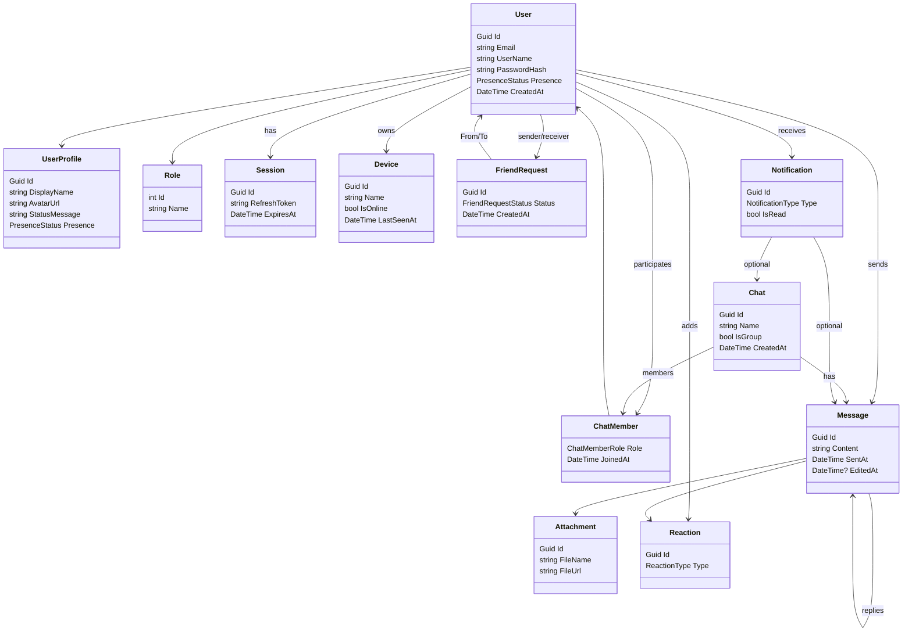

# UML Diagram

```mermaid
classDiagram
    class User {
        Guid Id
        string Email
        string UserName
        string PasswordHash
        PresenceStatus Presence
        DateTime CreatedAt
    }
    class UserProfile {
        Guid Id
        string DisplayName
        string AvatarUrl
        string StatusMessage
        PresenceStatus Presence
    }
    class Role {
        int Id
        string Name
    }
    class Session {
        Guid Id
        string RefreshToken
        DateTime ExpiresAt
    }
    class Device {
        Guid Id
        string Name
        bool IsOnline
        DateTime LastSeenAt
    }
    class Chat {
        Guid Id
        string Name
        bool IsGroup
        DateTime CreatedAt
    }
    class ChatMember {
        ChatMemberRole Role
        DateTime JoinedAt
    }
    class Message {
        Guid Id
        string Content
        DateTime SentAt
        DateTime? EditedAt
    }
    class Attachment {
        Guid Id
        string FileName
        string FileUrl
    }
    class Reaction {
        Guid Id
        ReactionType Type
    }
    class FriendRequest {
        Guid Id
        FriendRequestStatus Status
        DateTime CreatedAt
    }
    class Notification {
        Guid Id
        NotificationType Type
        bool IsRead
    }

    User --> Role
    User --> UserProfile
    User --> Device : owns
    User --> Session : has
    User --> ChatMember : participates
    User --> Message : sends
    User --> Reaction : adds
    User --> Notification : receives
    User --> FriendRequest : sender/receiver
    Chat --> ChatMember : members
    Chat --> Message : has
    ChatMember --> User
    Message --> Attachment
    Message --> Reaction
    Message --> Message : replies
    FriendRequest --> User : From/To
    Notification --> Message : optional
    Notification --> Chat : optional
```
